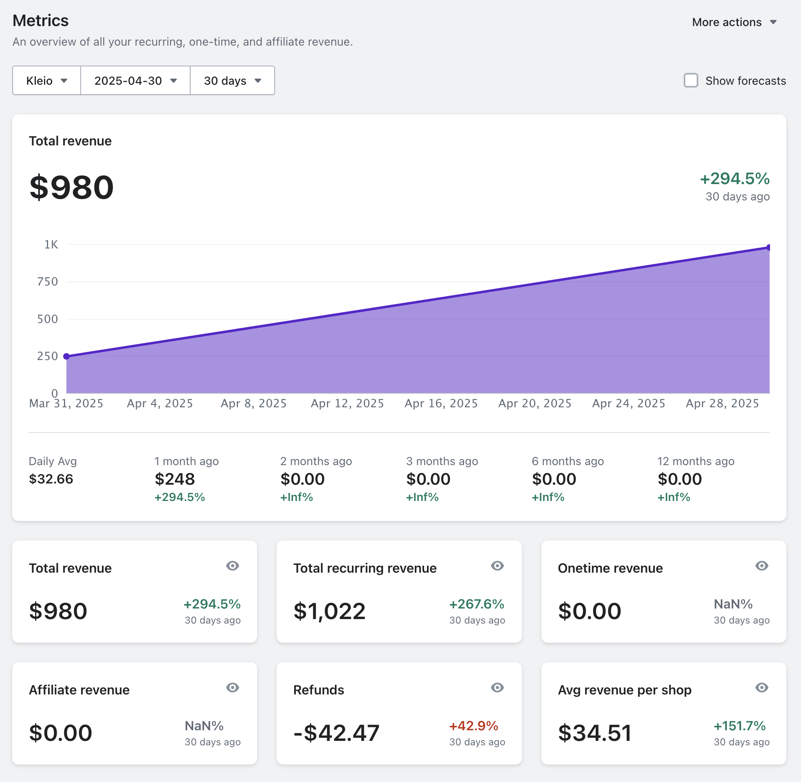

April is over, and it’s time to check in on the progress (hopefully). I’ll share:

1. The numbers
2. What I’ve been working on
3. The biggest mistake I’ve made

## The Numbers

Revenue: $980 (Up ~400% from $248)
Operating costs: ~$145 (Up ~31% from $110)
Profit: $835 (Up ~800% from $138)
Profit margin: 85.41% (Up ~150%)

(Note that I've switched from estimating MRR to using actual payout and expense data)

I would lie if I said I didn’t wish I’ve grown more in April. I really love the platform, and I think you get incredible value for money. But, I’ve spent 99% of my time on building, not marketing, so it’s really not surprising.

## Soooo, what have you been working on, if not marketing?

I’m a big believer in user experience. I think it’s as important as the product itself, if not more. It doesn’t matter how useful it is if it sucks to use.

At the core of app UX is speed. We don’t want to use slow apps. And I honestly thought I had a fast pretty fast platform. But then I had this one, big outlier of customer (almost 1M orders in the last year) who told me the platform was slow. I should probably have shrugged it off, given the size of the customer not being representative of 99.99% of my expected customer base. But, I couldn’t. Instead, I went down a giant rabbit hole and spend a lot of time learning how to make it faster.

I ended up doing a total rebuild of the database (which sucks donkey a\*\*, in case you were wondering), spend a lot of time on testing different indexes, changed the ~hole app to streaming the data while showing a skeleton page, and migrated ~all queries from Prisma (ORM) and to Kysely (query builder).

Not an overcorrection at all… But it ended up taking the worst data query, for that big outlier of a customer, from ~7s to ~3s (~60%). Which makes the platform insanely fast for pretty much all other customers. So I got that going for me, which is nice.

In the end, I love learning. It’s one of my quilte pleasures. So, it’s been worth it, no matter what. I did, however, make a mistake.

## The big mistake

It’s my first time building a SaaS. Looking back, I think I've made a mistake in how I “launched” Kleio, if we can call it that. I deliberately didn’t make a big show out of it, as I would just end up trying to perfect everything. Execution > perfection. But I should have done one thing differently.

What I did: got people to sign up for a waiting list and invited them as soon as I had a MVP/v1/whatever you want to call it. I was extremely happy with what I had built and wanted feedback (and $) as quickly as possible.

What I should have done: instead of inviting everyone from the waiting list ASAP, I should have invited the ~10-20 most interested stores while making sure they’re sufficiently different from each other as possible (for the widest type of feedback).

I think I would have gotten the ~same feedback, but then I could have removed all the kinks before inviting the rest of of the waiting list. And in turn, this would probably have reduced churn, and I could have built an even bigger waiting list in the meantime.

It’s a fine balance between getting feedback as fast as possible and not giving (too many) people access to a good-but-still-a-little-shitty-platform.

Oh well. You live and you learn.

Try my good-and-not-as-shitty-anymore-platform on [getkleio.com](https://getkleio.com).

You get a dashboard, lifetime value analytics, and everything else you need to confidently grow your online store — without paying a fortune ❤️
